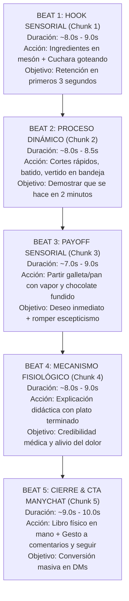

# ⏱️ ARQUITECTURA DE CHUNKS Y LOS 5 BEATS NARRATIVOS

Este documento detalla la estructura temporal y la progresión psicológica que convierte a estos videos en piezas de alta retención orgánica y conversión directa en Instagram y TikTok.

---

## 1. REGLA TÉCNICA DE LOS CHUNKS: LÍMITE INVIOLABLE <= 10.0s

### ¿Por qué 10 segundos como techo absoluto?
1. **Modelos de Video Generativo:** Tanto Google Omni Flash como Veo 2 y Kling AI rinden su máxima calidad y coherencia física en clips de 8 a 10 segundos. Sobrepasar los 10s genera pérdida de identidad en el rostro, alucinaciones en los dedos y desincronización de lip-sync.
2. **Edición Ágil:** Clips de 8 a 10s permiten un montaje dinámico donde cada corte tiene un objetivo narrativo concreto.

### Matriz de Distribución Temporal
| Duración Total del Video | Cantidad de Chunks | Rango por Chunk | Techo Máximo |
|---|---|---|---|
| **25 a 30 segundos** | 3 Chunks | 8.5s – 10.0s | **10.00s** |
| **35 a 42 segundos** | 4 Chunks | 8.5s – 9.8s | **10.00s** |
| **43 a 50 segundos** | 5 Chunks | 8.5s – 9.5s | **10.00s** |
| **50 a 60 segundos** | 6 Chunks | 8.5s – 10.0s | **10.00s** |

---

## 2. DESGLOSE DE LAS 5 FASES NARRATIVAS (LOS 5 BEATS)

---

## 3. ESPECIFICACIÓN DETALLADA POR BEAT

### 📌 BEAT 1 (Chunk 1): Hook de Curiosidad Sensorial & Presentación
* **Objetivo:** Frenar el scroll de inmediato.
* **Composición Visual:** Ángulo picado a pulso (20° a 45°). Helena mira al lente mientras deja caer un ingrediente espeso o líquido (mantequilla de maní, aguacate machacado, zanahoria rallada) en el tazón en primer plano.
* **Voiceover:** *"¿Sabías que si agregas / mezclas [A] con [B], agregas un toque de [C] y licúas todo hasta que quede suave..."*

### 📌 BEAT 2 (Chunk 2): Proceso Dinámico & Formado/Horneado
* **Objetivo:** Mantener el ritmo con micro-cortes sensoriales.
* **Composición Visual:** Cenital 60° y planos detalle inclinados. Espátula integrando ingredientes, cuchara de helado dispensando porciones sobre bandeja metálica con papel encerado, o molde entrando al horno caliente.
* **Voiceover:** *"...mezclas chispas de chocolate negro, formas pequeñas galletas con una cuchara y luego horneas hasta que estén firmes..."*

### 📌 BEAT 3 (Chunk 3): Payoff Sensorial Exagerado
* **Objetivo:** Provocar salivación y asombro visual.
* **Composición Visual:** Push-in frontal extremo. Helena rompe la galleta o el pan frente al lente a escasos centímetros de la cámara; se aprecia el vapor tenue, la miga húmeda y elástica, y el chocolate fundido. Helena prueba o sonríe orgullosa detrás del producto.
* **Voiceover:** *"...obtienes [producto] que es crujiente por fuera y suave por dentro, y nadie en tu casa va a adivinar jamás que la base es [ingrediente]... ¡totalmente libre de harina y azúcar!"*

### 📌 BEAT 4 (Chunk 4): Mecanismo Fisiológico Oculto
* **Objetivo:** Transformar un "postre rico" en una "herramienta de salud".
* **Composición Visual:** Plano medio cintura hacia arriba con balanceo natural. Helena gesticula didácticamente señalando el plato terminado en el mesón rústico. Hace ademanes suaves hacia el abdomen o ilustra una curva de glucosa plana con la mano.
* **Voiceover:** *"Estas galletas alimentan tus bacterias buenas, te mantienen lleno por horas y estabilizan tu azúcar en sangre para que los antojos desaparezcan por completo."*

### 📌 BEAT 5 (Chunk 5): Cierre de Conversión ManyChat con Follow-Gate
* **Objetivo:** Generar miles de comentarios automatizables con ManyChat.
* **Composición Visual:** Plano frontal cercano conversacional. Helena presenta el libro físico rústico a la altura del pecho. Apunta hacia abajo con su índice (zona de comentarios) y luego apunta hacia arriba a la derecha (botón de seguir) con una sonrisa cómplice.
* **Voiceover:** *"Si quieres más recetas como esta que te ayuden a combatir la inflamación de adentro hacia afuera, comenta la palabra [CLAVE] aquí abajo y sígueme para no perderte la próxima."*
